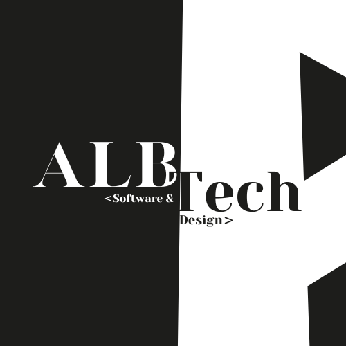

<picture>
  <source media="(prefers-color-scheme: dark)" srcset="./assets/img/bookabanner2.png">
  <source media="(prefers-color-scheme: light)" srcset="./assets/img/bookabanner.png">
  
</picture>


<div align="center" class>

# Sistema de Gerenciamento de Biblioteca - Book A

</div>

Como projeto de conclusão do nosso curso técnico, optamos por uma dor que estava disponível no Saga Senai, aonde teríamos que estar tentando resolver o problema da empresa contratante. 


<div align="center"> 

## Introdução ao Projeto

</div>


### :broken_heart: Explicando a Dor
A biblioteca SENAI/CETEC de Araguaína estava com um sério problema de registro de clientes, onde as anotações e documentos eram armazenados numa planilha de forma desatualizada e desorganizada, além dos administradores afirmarem estar de uma maneira não dinâmica, gerando atraso e balbúrdia durante os registros.

### :bulb: A Solução
Visamos tentar suprir as necessidades da empresa por meio de um dashboard que controlasse o cadastro dos clientes e monitora-se cada arquivo ou documento que fosse registrado. Esse sistema posteriormente foi nomeado de Book A (Book A Book).


<div align="center"> 

## :book: Sobre o Book A

</div>


<div align="center">

<picture>
  <source media="(prefers-color-scheme: dark)" srcset="./assets/img/logo.png">
  <source media="(prefers-color-scheme: light)" srcset="./assets/img/logo2">
  
</picture>

</div>


### :page_with_curl: Requisitos

Após nos reunirmos para poder realizar o trabalho, nos deparamos com alguns requisitos que seriam necessários para que a dor fosse solucionada. São eles

- Gerenciamento de todos os aspectos: Devemos desenvolvevor um projeto que possa estar fazendo a gestão de usuários, livros e empréstimos de forma mais clara;

- Filtragem de registros: Devemnos tentar deixar a navegação pelos registros mais fácil e dinâmica, então seria necessário estar criando um filtro para fazer uma pesquisa mais certeira;

- Relatórios: Para que seja possível visualizar os processos envolvendo os livros e usuários, um dos nossos objetivos é tentar desenvolver um meio de gerar relatórios dos aspectos da biblioteca;

- Log de Eventos: Como uma medida de segurança a mais, tentaremos implementar uma tabela que mostrará todas as movimentações efetuadas no sistema, seja um cadastro, uma alteração ou exclusão.


### :wrench: Ferramentas Utilizadas

As ferramentas utilizadas para poder estar desenvolvendo esse projeto são:

- Trello - Para organizar e distribuir tarefas;
- Figma - Criar o design e protótipo inicial;
- Visual Studio Code - Desenvolver todo o sistema em si;
- XAMPP - Poder usar o servidor Apache, o responsável por fazer o PHP ser utilizado;
- DBDesigner - Criar o protótipo do banco de dados;
- MySQL Query Browser - Desenvolver o banco de dados;


### :gear: Linguagens e Bibliotecas Utilizadas

A seguir, estão listadas algumas linguagens (programação, estilo e hipertexto) que foram utilizadas no desenvolvimento do site:

<div align="center">

[](https://skillicons.dev)

</div>


### :blue_book: Função ISBN

O ISBN é um identificador único e universal para livros. Assim como o RG identifica uma pessoa de maneira única, o ISBN permite que cada livro seja diferenciado dos demais por meio de um código exclusivo. Com o ISBN, é possível descobrir uma série de informações valiosas sobre um livro específico. Desde o título e o autor até detalhes sobre a edição, editora, país de publicação e outras informações relevantes, tudo pode ser acessado através deste número.

No nosso projeto, o ISBN foi utilizado através de uma API do Google Books, onde é possível estar buscando as informações de um livro existente na biblioteca do Google Books e trazendo as mesmas para o Book A, onde poderá ser feito o cadastro do mesmo no nosso banco de dados.

> [!NOTE]
> Nós optamos por estar utilizando a API especificamente do Google Books pois é uma API gratuita e de fácil uso, nos fazendo poupar tempo no desenvolvimento.


<div align="center"> 

## :pushpin: Versão do Projeto

</div>

Esse projeto, por mais que já tenha sido apresentado, não está em sua versão final e desejamos sim estar dando continuidade ao mesmo futuramente, implementando as partes que faltam e corrigindo as que podem melhorar.


<div align="center"> 

```
A versão atual do nosso site é: 1.02
```

</div>


<div align="center"> 

## 🌟 Nossa Equipe

A nossa Equipe é composta por 4 integrantes, e são eles:

</div>


| | |
|1|2|

|<a href="https://www.instagram.com/felpzinea/" style="color: white; font-weight: 700;">  Ana Luísa </a>  |  <a href="" style="color: white; font-weight: 700;">  Giovana de Oliveira </a>  |  <a href="" style="color: white; font-weight: 700;">  José Omar </a>  |  <a href="" style="color: white; font-weight: 700;">  Vitória de Oliveira </a>  |


### :office: Nossa Empresa

<div align="center">
    


<p>AlbTech</p>
<p>Desenvolvendo seu sistema, focando no seu problema</p>

</div>

Nós somos a AlbTech, uma empresa de desenvolvimento de software e design que visa solucionar os problemas de nossos clientes com a criação de softwares acessíveis, ágeis e personalizados de acordo com o que é necessário, focando no problema do usuário


<div align="center"> 

## :revolving_hearts: Agradecimentos

</div>
    
<p>Agradecemos e dedicamos essa parte a nosso professor e instrutor Luciano Coelho Pettersen, que nos auxiliou durante todo o nosso trajeto e  caminhada através do curso, nos ensinando o necessário para que possamos estar entregando esse trabalho final.</p>


<!-- 
</foreignObject>

</svg> -->


